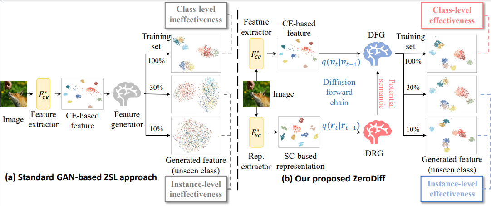
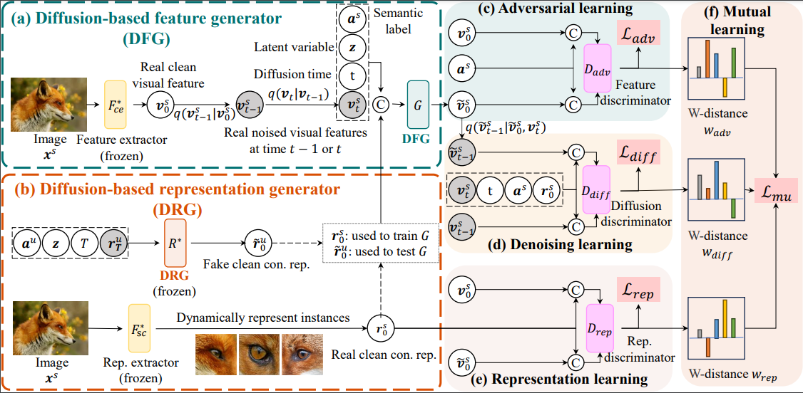

# PyTorch implementation of "ZeroDiff: Solidified Visual-semantic Correlation in Zero-Shot Learning" [ICLR 2025 Paper] #

**Paper:** https://openreview.net/pdf?id=wy9FRV8O5s / https://arxiv.org/abs/2406.02929

Zero-shot Learning (ZSL) aims to enable classifiers to identify unseen classes. This is typically achieved by generating visual features for unseen classes based on learned visual-semantic correlations from seen classes. However, most current generative approaches heavily rely on having a sufficient number of samples from seen classes. Our study reveals that a scarcity of seen class samples results in a marked decrease in performance across many generative ZSL techniques. We argue, quantify, and empirically demonstrate that this decline is largely attributable to spurious visual-semantic correlations. To address this issue, we introduce ZeroDiff, an innovative generative framework for ZSL that incorporates diffusion mechanisms and contrastive representations to enhance visual-semantic correlations. ZeroDiff comprises three key components: (1) Diffusion augmentation, which naturally transforms limited data into an expanded set of noised data to mitigate generative model overfitting; (2) Supervised-contrastive (SC)-based representations that dynamically characterize each limited sample to support visual feature generation; and (3) Multiple feature discriminators employing a Wasserstein-distance-based mutual learning approach, evaluating generated features from various perspectives, including pre-defined semantics, SC-based representations, and the diffusion process. Extensive experiments on three popular ZSL benchmarks demonstrate that ZeroDiff not only achieves significant improvements over existing ZSL methods but also maintains robust performance even with scarce training data.

<div align="center">
    
</div>

<div align="center">
    
</div>

## Prerequisites
+ Python 3.8
+ Pytorch 1.12.1
+ torchvision 0.13.1
+ scikit-learn 1.3.0
+ scipy=1.10.0
+ numpy 1.24.3
+ numpy-base 1.24.3
+ pillow 9.4.0

## Data preparation

We trained the model on three popular ZSL benchmarks: [CUB](http://www.vision.caltech.edu/visipedia/CUB-200-2011.html), [SUN](http://cs.brown.edu/~gmpatter/sunattributes.html) and [AWA2](http://cvml.ist.ac.at/AwA2/) following the data split of [xlsa17](http://datasets.d2.mpi-inf.mpg.de/xian/xlsa17.zip).

Our fine-tuned features can be downloaded from https://drive.google.com/drive/folders/1MW_GPqN7g9idJrtYg8eLszqFMXj-YKrq?usp=drive_link.

The data percent splitting can be downloaded from https://drive.google.com/drive/folders/1erHqyL42wJ1b7oWKkrPTyb2EoCxkFVqb?usp=drive_link. 

### Download Dataset 

Firstly, download these datasets as well as the xlsa17 and our data splitting and fine-tuned features. Then decompress and organize them as follows: 
```
.
├── Dataset
│   ├── CUB/CUB_200_2011/...
│   ├── SUN/images/...
│   ├── AWA2/Animals_with_Attributes2/...
│   ├── Attribute/w2v/...
│   └── xlsa17/data
│              ├── AWA2
│                  ├── att_splits.mat
│                  ├── ce_ce.mat
│                  ├── con_paco.mat
│                  ├── split_10percent.mat
│                  ├── split_30percent.mat
│                  └── res101.mat
│              ├── CUB/...
│              └── SUN/...
└── ···
```

## Training

To train and evaluate ZSL and GZSL models, please run the file `./scripts/train_awa2_zerodiff_DRG.py` then the scripts `./scripts/train_awa2_zerodiff_DFG`, e.g.:
```
python ./scripts/train_awa2_zerodiff_DRG.py
```
Then
```
python ./scripts/train_awa2_zerodiff_DFG.py
```

## Results
Following table shows the results of our released models using various evaluation protocols on three datasets, both in the ZSL and GZSL settings:

| Dataset | T1 (ZSL) | U (GZSL) | S (GZSL) | H (GZSL) |
| :-----: | :-----: | :-----: | :-----: | :-----: |
| CUB | 87.5 | 80.0 | 83.2 | 81.6 |
| AWA2 | 87.3 | 74.7 | 89.3 | 81.4 |
| SUN | 77.3 | 63.0 | 56.9 |  59.8 |

## Customized Fine-tuning
We also provide our fine-tuning code in  `./FineTune`. You can change it with your own loss or algorithm.

## License

This code is released under the MIT License. See [LICENSE](LICENSE) for additional details.

## Bibtex ##
If this work is helpful for you, please cite our paper:

```
@inproceedings{
ye2025zerodiff,
title={ZeroDiff: Solidified Visual-semantic Correlation in Zero-Shot Learning},
author={Zihan Ye and Shreyank N Gowda and Shiming Chen and Xiaowei Huang and Haotian Xu and Fahad Shahbaz Khan and Yaochu Jin and Kaizhu Huang and Xiaobo Jin},
booktitle={The Thirteenth International Conference on Learning Representations},
year={2025},
url={https://openreview.net/forum?id=wy9FRV8O5s}
}
```

## References
Parts of our codes based on:
* [akshitac8/tfvaegan](https://github.com/akshitac8/tfvaegan)
* [ZhishengXiao/DenoisingDiffusionGAN](https://github.com/NVlabs/denoising-diffusion-gan)
* [Jiequan/PACO](https://github.com/dvlab-research/Parametric-Contrastive-Learning)
